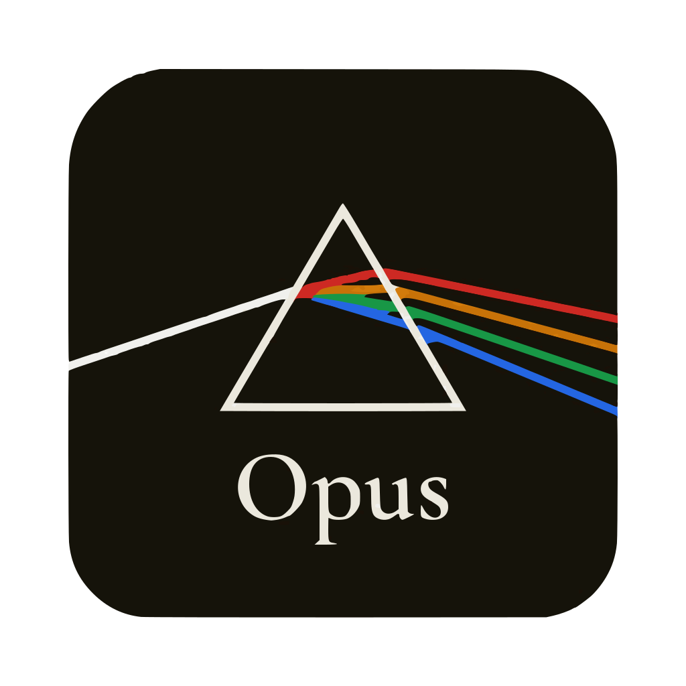
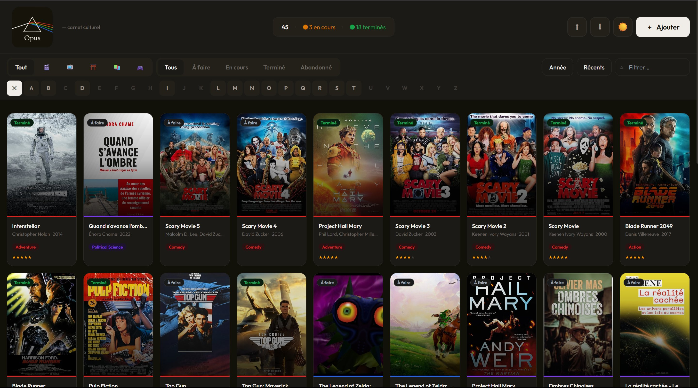

<div align="center">
  
  <h1>Opus</h1>
  <p><strong>Carnet culturel personnel</strong></p>
  <p>Suivez vos films, séries, animés, livres et jeux vidéo — avec recherche automatique, gestion des états et notation par étoiles.</p>
</div>

---



---

## Modes d'utilisation

Opus s'adapte à ton setup — trois façons de l'utiliser, du plus simple au plus pérenne.

---

### Mode 1 — Fichier HTML local (sans installation)

**Le plus simple.** Ouvre `index.html` directement dans ton navigateur, aucune installation requise.

- ✅ Zéro installation
- ✅ Fonctionne sur tous les OS
- ⚠️ Données perdues si tu vides le cache du navigateur

```
Télécharge index.html → Ouvre dans le navigateur → C'est prêt
```

---

### Mode 2 — Application desktop Windows / Linux (recommandé)

**La meilleure expérience.** Une vraie application installée sur ton PC, qui tourne sans navigateur.

- ✅ Données stockées localement dans `%AppData%\opus\opus-data.json`
- ✅ Fonctionne hors ligne (sauf pour la recherche d'œuvres)
- ✅ Icône dans le menu démarrer et le bureau
- ✅ Import / Export natif via dialog fichier Windows
- ✅ Mise à jour facile via `update.ps1`

**Installation Windows :**
```
1. Télécharge et extrais le dossier opus-electron/
2. Remplis tes clés API dans index.html (OMDB + RAWG)
3. Double-clique sur installer.ps1
4. Lance Opus Setup 1.0.0.exe
```

**Mise à jour :**
```
Double-clique sur update.ps1
→ Télécharge la dernière version depuis GitHub
→ Rebuild automatique
```

> Le dossier `opus-electron/` contient tout le nécessaire.

---

### Mode 3 — Hébergement local sur VM ou NAS (persistant, multi-appareils)

**Pour accéder depuis plusieurs appareils sur ton réseau local.** Déploie Opus sur une machine dédiée (PC recyclé, Raspberry Pi, mini PC, NAS).

- ✅ Accessible depuis tous les appareils du réseau (PC, téléphone, tablette)
- ✅ Données dans PostgreSQL — robuste et sauvegardable
- ✅ Aucun accès externe requis
- ⚙️ Nécessite Ubuntu + Node.js + PostgreSQL + Nginx + PM2

```
http://IP_DE_TA_MACHINE  →  accessible sur tout ton réseau local
```

---

## Fonctionnalités

- Recherche automatique via APIs gratuites (affiches, genres, dates, créateurs)
- 5 catégories : Films · Séries · Animés · Livres · Jeux vidéo
- 4 états : À faire · En cours · Terminé · Abandonné
- Notation ★ sur 5 pour les œuvres terminées
- Sélection multiple lors de l'ajout (pratique pour les sagas)
- Filtres par catégorie, état, lettre A→Z, année de sortie
- Recherche texte en temps réel + tri
- Export / Import JSON pour synchroniser plusieurs installations
- Mode clair / Mode sombre

---

## APIs utilisées

| Catégorie  | API          | Inscription | Lien                                |
|------------|--------------|-------------|-------------------------------------|
| Films      | OMDb         | Email seul  | https://omdbapi.com                 |
| Séries     | TVmaze       | ❌ aucune   | https://tvmaze.com/api              |
| Animés     | AniList      | ❌ aucune   | https://anilist.gitbook.io          |
| Livres     | Google Books | ❌ aucune   | https://developers.google.com/books |
| Jeux vidéo | RAWG         | Email seul  | https://rawg.io/apidocs             |

---

## Configuration des clés API

Dans `index.html`, remplace les constantes en haut du script :

```js
const OMDB_KEY = 'VOTRE_CLE_OMDB';  // → https://omdbapi.com
const RAWG_KEY = 'VOTRE_CLE_RAWG';  // → https://rawg.io/apidocs
```

TVmaze, AniList et Google Books ne nécessitent aucune clé.

---

## Structure du projet

```
opus/
├── index.html              ← Frontend standalone (tous les modes)
├── assets/
│   ├── logo.svg
│   └── screenshot.png
├── opus-electron/          ← Application desktop (Mode 2)
│   ├── index.html
│   ├── package.json
│   ├── installer.ps1       ← Installation Windows
│   ├── update.ps1          ← Mise à jour Windows
│   ├── electron/
│   │   ├── main.js
│   │   └── preload.js
│   └── assets/
│       ├── icon.ico
│       └── icon.png
├── server/                 ← API REST (Mode 3)
│   ├── index.js
│   ├── package.json
│   └── .env.example
├── nginx/
│   └── opus.conf
├── .gitignore
└── README.md
```

---

## Mode 3 — Installation VM détaillée

### Prérequis

- Ubuntu 22.04 ou 24.04
- Node.js 20 LTS · PostgreSQL 14+ · Nginx · PM2

### Installation en une commande

```bash
sudo apt update && sudo apt upgrade -y
curl -fsSL https://deb.nodesource.com/setup_20.x | sudo -E bash -
sudo apt install -y nodejs postgresql postgresql-contrib nginx git
sudo systemctl enable postgresql nginx
sudo npm install -g pm2
```

### Base de données

```bash
sudo -u postgres psql << 'SQL'
CREATE USER opus WITH PASSWORD 'CHANGE_MOI';
CREATE DATABASE opus OWNER opus;
\q
SQL
```

### Backend

```bash
sudo mkdir -p /opt/opus-api && sudo chown -R $USER:$USER /opt/opus-api
cp server/* /opt/opus-api/ && cd /opt/opus-api
npm install && cp .env.example .env && nano .env
pm2 start index.js --name opus-api && pm2 save
```

### Frontend

```bash
sudo mkdir -p /var/www/opus && sudo cp index.html /var/www/opus/
# Dans index.html : const API = 'http://IP_DE_TA_MACHINE/api';
```

### Nginx

```bash
sudo cp nginx/opus.conf /etc/nginx/sites-available/opus
sudo ln -s /etc/nginx/sites-available/opus /etc/nginx/sites-enabled/
sudo rm /etc/nginx/sites-enabled/default
sudo nginx -t && sudo systemctl reload nginx
```

### Mise à jour du frontend

```bash
sudo cp ~/index.html /var/www/opus/index.html
# Ctrl+F5 dans le navigateur
```

---

## Export / Import

Le bouton **⬆** exporte ta bibliothèque en JSON.
Le bouton **⬇** importe un fichier JSON en ajoutant uniquement les œuvres absentes (zéro doublon).

Utile pour synchroniser entre l'app desktop, le site web, et d'autres machines.

---

## Endpoints API (Mode 3)

| Méthode | Route            | Description       |
|---------|------------------|-------------------|
| GET     | `/api/items`     | Tous les items    |
| GET     | `/api/items/:id` | Un item           |
| POST    | `/api/items`     | Créer un item     |
| PUT     | `/api/items/:id` | Modifier un item  |
| DELETE  | `/api/items/:id` | Supprimer un item |
| GET     | `/api/health`    | Statut de l'API   |

---

## Stack technique

| Couche          | Technologie                                   |
|-----------------|-----------------------------------------------|
| Frontend        | React 18 + Tailwind CSS (via CDN)             |
| Desktop         | Electron 28                                   |
| Recherche       | OMDb · TVmaze · AniList · Google Books · RAWG |
| Backend         | Node.js + Express                             |
| Base de données | PostgreSQL                                    |
| Proxy           | Nginx                                         |
| Process manager | PM2                                           |
